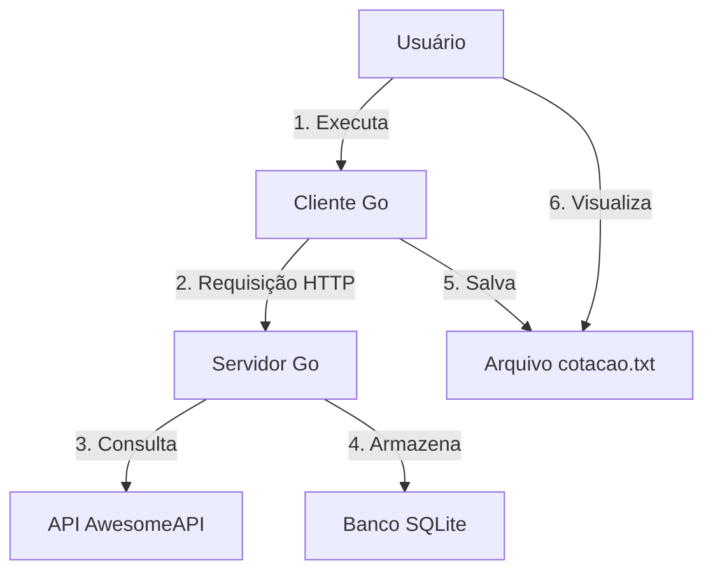
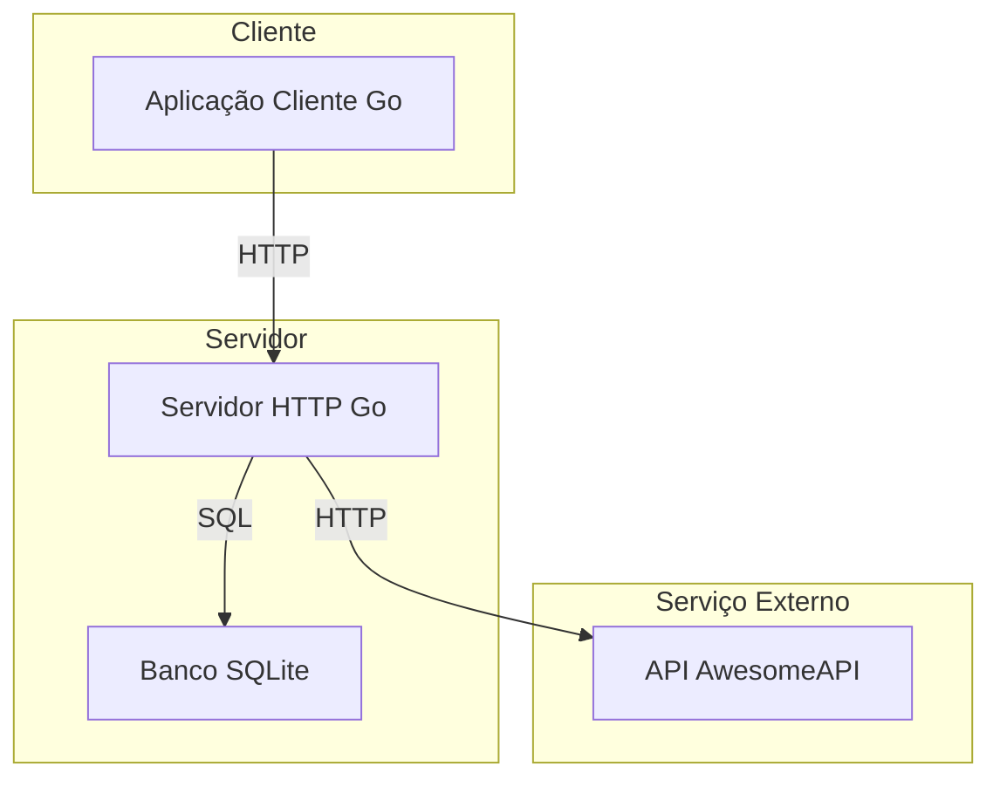
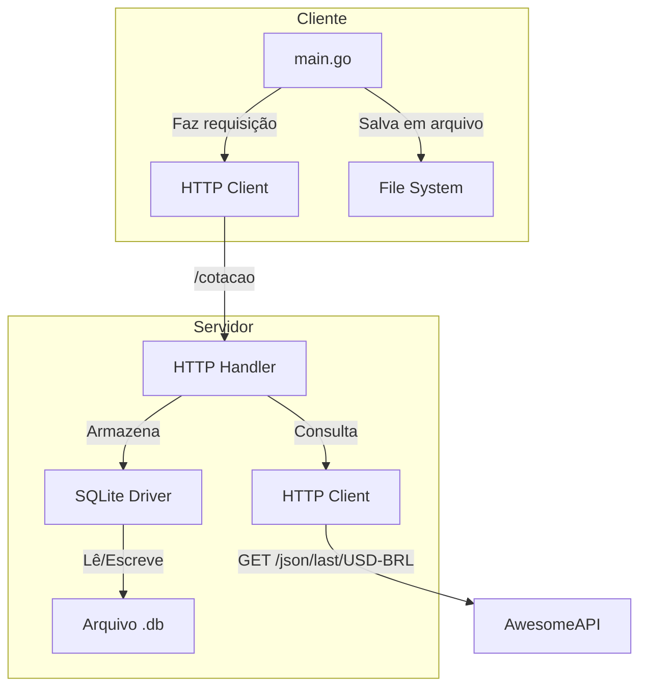

# Sistema de Cotação de Moedas

Este é um sistema cliente-servidor em Go que obtém a cotação atual do dólar em relação ao real e a armazena em um banco de dados SQLite.

## Visão Geral

O sistema é composto por dois componentes principais:

1. **Servidor (server)**: Um servidor HTTP que:
   - Expõe um endpoint `/cotacao`
   - Consulta a API de cotações (https://economia.awesomeapi.com.br/json/last/USD-BRL)
   - Armazena a cotação em um banco de dados SQLite
   - Implementa timeouts para operações de rede e banco de dados

2. **Cliente (client)**: Um cliente que:
   - Faz requisições para o servidor
   - Salva a cotação em um arquivo `cotacao.txt`
   - Implementa timeout para a requisição

## Diagrama de Arquitetura C4

### Nível 1: Diagrama de Contexto



### Nível 2: Diagrama de Contêiner



### Nível 3: Diagrama de Componentes



## Requisitos

- Go 1.24.2 ou superior
- Módulo `github.com/mattn/go-sqlite3`

## Estrutura do Projeto

```
desafio-client-server-api/
├── client/
│   └── main.go
├── server/
│   └── main.go
├── go.mod
├── go.sum
└── README.md
```

## Como Executar

1. Inicie o servidor:
   ```bash
   cd server
   go run main.go
   ```

2. Em outro terminal, execute o cliente:
   ```bash
   cd client
   go run main.go
   ```

3. Verifique o arquivo `cotacao.txt` no diretório do cliente para ver a cotação obtida.

## Timeouts

- **Cliente**: 300ms para receber resposta do servidor
- **Servidor**:
  - 200ms para consultar a API externa
  - 10ms para salvar no banco de dados

## Banco de Dados

O servidor utiliza um banco SQLite chamado `cotacoes.db` que é criado automaticamente. A tabela `cotacoes` armazena o histórico de cotações com os seguintes campos:

- `id`: Identificador único (INTEGER PRIMARY KEY AUTOINCREMENT)
- `valor`: Valor da cotação (TEXT)
- `data`: Data e hora da cotação (DATETIME DEFAULT CURRENT_TIMESTAMP)

## Testes

Para testar o sistema, execute o cliente após iniciar o servidor. O cliente irá exibir uma mensagem de sucesso e salvará a cotação no arquivo `cotacao.txt`.

## Monitoramento

O servidor registra eventos importantes no console, incluindo:
- Início do servidor
- Erros de requisição
- Erros de banco de dados
- Erros de decodificação de resposta

## Limitações

- O cliente não tenta se reconectar em caso de falha
- Não há autenticação ou autorização nas APIs
- O banco de dados é local e não escalável horizontalmente

## Próximos Passos

- [ ] Adicionar testes unitários e de integração
- [ ] Implementar logs estruturados
- [ ] Adicionar métricas de monitoramento
- [ ] Implementar cache para reduzir chamadas à API externa
- [ ] Adicionar documentação da API com Swagger/OpenAPI
